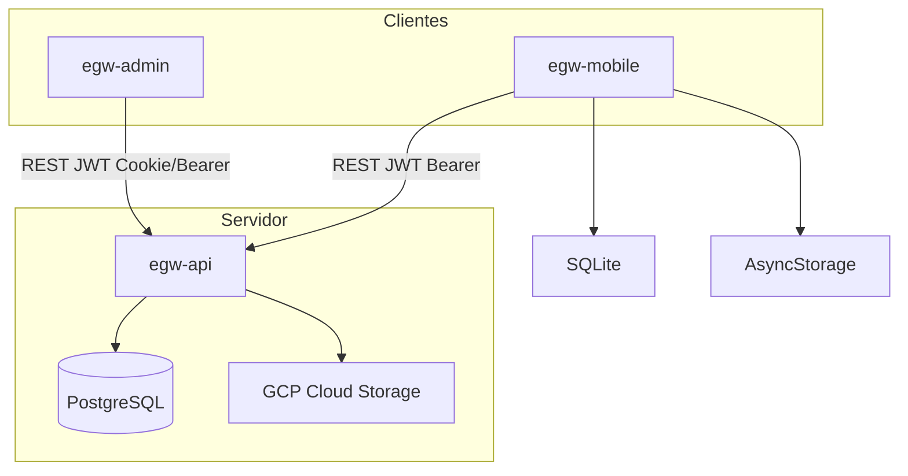
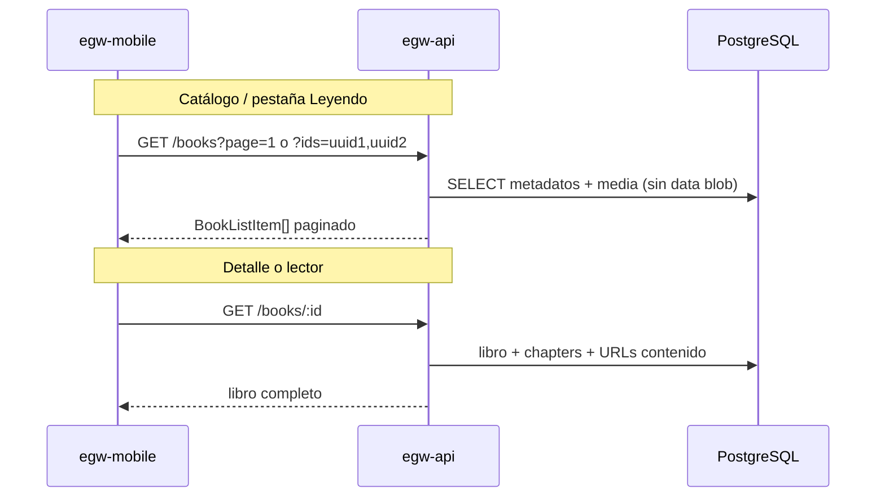

# Arquitectura — Plataforma EGW Writings (Plan Plata)

## Visión general

Plataforma digital multi-cliente para lectura y gestión editorial, inspirada en EGW Writings.

| Componente | Tecnología | Repositorio Git |
|------------|------------|-----------------|
| API REST | NestJS 11 + Prisma + PostgreSQL | `egw-api` |
| App móvil | Expo React Native (offline-first) | `egw-mobile` |
| Panel admin | React + Vite + TypeScript | `egw-admin` |
| Infraestructura | PostgreSQL (Render/GCP) | servicio gestionado |
| Documentación | Markdown + OpenAPI | `egw-docs` |

Mapa de repos y clonado local: [REPOS.md](./REPOS.md).

## Diagrama de componentes

## Flujo de autenticación

1. **Móvil**: `POST /api/v1/auth/login` → access + refresh token → SecureStore + Bearer en requests.
2. **Admin**: mismo endpoint; tokens en localStorage o cookie httpOnly (configurable).
3. **Refresh**: `POST /api/v1/auth/refresh` antes de expirar access token (15 min).
4. **RBAC**: `JwtAuthGuard` + `RolesGuard` + permisos por recurso.

## Flujo offline (móvil)

1. Usuario descarga libro → API devuelve metadatos + URL firmada → contenido en SQLite/archivo local.
2. Lectura y marcadores se guardan localmente con `synced = 0`.
3. Al reconectar: `POST /api/v1/sync/push` sube cambios; `GET /api/v1/sync/state` trae estado remoto.

## Decisiones técnicas (Plan Plata)

| Decisión | Elección | Motivo |
|----------|----------|--------|
| API | REST versionada `/api/v1` | Simplicidad MVP |
| IDs | UUID v4 | Seguridad y distribución |
| ORM | Prisma | Tipado y migraciones |
| Auth móvil | JWT Bearer | Estándar Expo |
| Storage multimedia | Inline en PostgreSQL (≤5 MB) + URLs externas / GCS | Sin disco en servidor |
| i18n | No incluido | Plan Oro+ |

## Flujo de contenido multimedia

La plataforma replica la experiencia de **EGW Writings** en tres verticales:

| Vertical | Experiencia UX | API |
|----------|----------------|-----|
| **Biblioteca** | Lectura de libros y capítulos | `GET /books` (listado ligero), `GET /books/:id` (detalle + capítulos), `GET /books?ids=` (batch) |
| **Audio / Radio** | Podcasts (estilo Spotify) + emisoras en vivo | `GET /podcasts/series`, `GET /radio/stations` |
| **Videos** | Catálogo con reproductor (estilo YouTube) | `GET /videos`, `GET /videos/:id` |

Archivos pequeños (≤5 MB) se almacenan inline en PostgreSQL; audios/videos largos usan URLs externas (`MediaStorage.EXTERNAL`).

## Rendimiento biblioteca (listado vs detalle)

El catálogo móvil puede listar decenas de libros por pantalla. Para evitar respuestas pesadas:

| Capa | Decisión |
|------|----------|
| **API** | `findBooks` no carga `media_assets.data` (HTML/audio inline); solo `id`, `storage`, `url`, `mimeType` para resolver `coverUrl` / `contentUrl`. |
| **API** | `GET /books?ids=` permite batch (máx. 100) para «Leyendo ahora» sin N+1. |
| **API** | `GET /study/book-ids` devuelve solo IDs con notas/resaltados; no sustituye los listados completos de estudio. |
| **Móvil** | Hook compartido `useReadingActivity`: una carga de sync + book-ids, cache TanStack Query ~60 s. |
| **Móvil** | Catálogo: `staleTime` 5 min; filtros categorías/colecciones: 10 min. |
| **Móvil** | SQLite local guarda progreso y libros descargados; el catálogo completo en caché persistente queda pendiente (ver [ROADMAP.md](./ROADMAP.md)). |

## Escalabilidad futura (Plan Oro/Platino)

- Búsqueda avanzada: Elasticsearch o PostgreSQL full-text
- CDN: Cloud CDN delante de GCS
- Sync avanzado: conflict resolution por `vector clock` o `updatedAt` con merge

## Referencias

- [DATABASE.md](./DATABASE.md) — modelo de datos
- [API.md](./API.md) — convenciones REST
- [ROLES.md](./ROLES.md) — matriz de permisos
- [openapi.yaml](./openapi.yaml) — contrato OpenAPI
