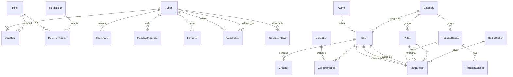

# Base de datos — Modelo ER (Plan Plata)

PostgreSQL 16. Schema definido en el repositorio **egw-api**: `prisma/schema.prisma`.

## Diagrama ER simplificado

## Entidades principales

### Auth y usuarios

| Tabla | Descripción |
|-------|-------------|
| `users` | Usuario, email, password hash, nombre, avatar opcional (`avatar_id` → `media_assets`), portada (`cover_id`), foco de portada (`cover_focus_x`, `cover_focus_y`, 0–100), aceptación de términos, estado activo (`is_active`), **`can_post`** (permite publicar en comunidad; default `true`), **`deleted_at`** (cuenta anonimizada/eliminada), **`is_official`** (cuenta @resvepro) |
| `user_follows` | Grafo social: `follower_id` sigue a `following_id` (PK compuesta) |

### Comunidad (MongoDB)

Colecciones en MongoDB (no Prisma). Ver `ENV.md` para la URI.

| Colección | Descripción |
|-----------|-------------|
| `community_posts` | Publicaciones del feed: `authorId`, `body`, `kind`, **`visibility`** (`PUBLIC` \| `CONNECTIONS`, default `PUBLIC`), adjuntos, tags, menciones, reacciones, etc. |
| `community_comments` | Comentarios por `postId` |
| `community_reactions` | Reacciones por usuario y post |

**Visibilidad:** `PUBLIC` = cualquier lector autenticado; `CONNECTIONS` = autor + usuarios con follow en cualquier dirección hacia el autor. Los documentos legacy sin `visibility` se tratan como `PUBLIC`.
| `study_folders` | Carpetas de estudio por usuario (`parent_id` opcional para anidar) |
| `study_notes` | Notas de estudio (`folder_id`, `book_id`, `chapter_id` opcionales) |
| `highlights` | Citas subrayadas en lectura (`book_id`, `chapter_id`, `excerpt`) |
| `refresh_tokens` | Token hash, expiración, revocado |
| `password_reset_tokens` | Token único, expiración |

### RBAC

| Tabla | Descripción |
|-------|-------------|
| `roles` | SUPER_ADMIN, ADMIN_GENERAL, ADMIN_MODULAR, LECTOR |
| `permissions` | Recurso + acción (ej. `books:create`) |
| `role_permissions` | N:M rol-permiso |
| `user_roles` | N:M usuario-rol |

### Biblioteca

| Tabla | Descripción |
|-------|-------------|
| `authors` | Nombre, biografía, slug |
| `categories` | Nombre, slug, orden |
| `collections` | Nombre, descripción, slug |
| `books` | Título, slug, resumen, autor, categoría, portada, `is_audiobook`, `audio_id` (media AUDIO) |
| `chapters` | bookId, título, orden, contenido **HTML sanitizado** (TipTap en admin: `p`, `h2`, `h3`, listas, citas, enlaces) |
| `collection_books` | Orden dentro de colección |

### Lectura y sync

| Tabla | Descripción |
|-------|-------------|
| `bookmarks` | userId, bookId, chapterId, posición, nota |
| `reading_progress` | userId, bookId, chapterId, porcentaje (único por usuario-libro) |
| `favorites` | Favoritos polimórficos: `target_type` (BOOK/PODCAST/VIDEO/POST) + `target_id` |
| `user_downloads` | Registro de descargas offline |
| `sync_cursors` | Última sync por usuario y tipo |

### Streaming (audio y video)

| Tabla | Descripción |
|-------|-------------|
| `podcast_series` | Serie de podcast: título, slug, autor, portada, publicado |
| `podcast_episodes` | Episodio: orden, duración, audio (`media_assets`) |
| `videos` | Video: título, slug, miniatura, archivo o YouTube (`source_type`, `youtube_video_id`), duración, vistas, categoría |
| `content_views` | Vista única por usuario y contenido (`user_id`, `target_type`, `target_id`); evita duplicar `view_count` |
| `radio_stations` | Emisora en vivo: nombre, `stream_url`, portada, orden |

### Plataforma (app y panel)

| Tabla | Descripción |
|-------|-------------|
| `user_requirements` | Solicitudes/requerimientos enviados por usuarios desde la app |
| `legal_documents` | Términos, privacidad, cookies, normas de uso (versionados) |
| `app_settings` | Configuración clave-valor (soporte, mantenimiento, versión mínima, **marca/colores**, **seguridad JWT** — solo admin) |
| `app_sections` | Secciones de la app móvil: títulos, iconos, textos de pestañas y encabezados |
| `app_drawer_items` | Ítems del menú lateral: grupos, etiquetas, rutas, iconos y orden |
| `app_manual_sections` | Secciones del manual (`audience` APP \| PANEL): app móvil y panel web; seed versionado desde `manual-sections.seed.ts` |
| `app_tutorial_steps` | Pasos del tutorial de bienvenida para usuarios nuevos |
| `audit_logs` | Auditoría de acciones admin: actor, acción, recurso, resumen, IP, metadata JSON |
| `moderation_reports` | Reportes de usuarios sobre publicaciones, comentarios, imágenes o perfiles; revisión admin |

Campos de `moderation_reports`: `reporter_id`, `target_type` (POST/USER/COMMENT/POST_IMAGE), `target_id`, `reason`, `details`, `context_url`, `status` (PENDING/IN_REVIEW/RESOLVED/DISMISSED), `admin_notes`, `reviewed_by_id`, `reviewed_at`. Índice único por (`reporter_id`, `target_type`, `target_id`) para evitar duplicados.

Las categorías usan `kind` (`BOOK`, `PODCAST`, `VIDEO`) para filtrar por tipo de contenido.

### Multimedia

| Tabla | Descripción |
|-------|-------------|
| `media_assets` | Tipo, storage (`INLINE`/`EXTERNAL`), base64 o URL (`data` / `url`), mime, tamaño |

**Convención API:** en listados (`GET /books`, favoritos, etc.) las relaciones a `media_assets` se proyectan sin el campo `data` (contenido inline). El blob solo se sirve vía `GET /media/:id/content` cuando el cliente abre el lector o descarga.

## Índices clave

- `books.slug` — UNIQUE
- `chapters(book_id, order)` — UNIQUE compuesto
- `reading_progress(user_id, book_id)` — UNIQUE
- `users.email` — UNIQUE
- `users.username` — UNIQUE

## Convenciones

- Timestamps: `createdAt`, `updatedAt` en todas las tablas mutables
- Soft delete: no en Plata; usar `isActive` en users/books si se requiere
- Slugs: generados desde título, únicos por entidad

## SQLite local (móvil)

Espejo simplificado en el repositorio **egw-mobile** (`src/db/schema.ts`) para offline: `books`, `chapters`, `bookmarks`, `reading_progress`, `download_queue`.
