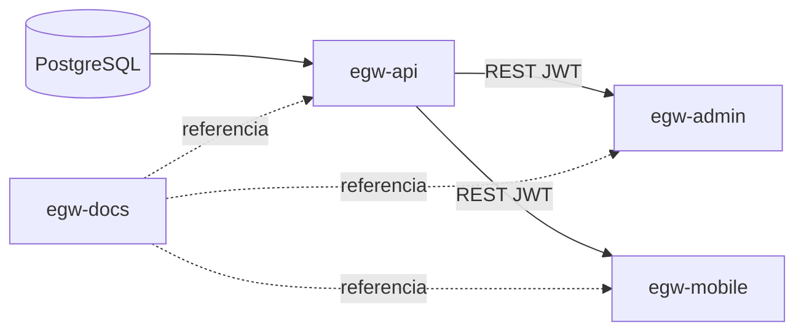

# Repositorios — EGW Writings

La plataforma se divide en **cuatro repositorios independientes**. No hay monorepo: cada uno tiene su propio ciclo de versiones, CI/CD y despliegue.

## Mapa de repositorios

| Repo | Responsabilidad | Stack principal |
|------|-----------------|-----------------|
| `egw-docs` | Documentación y contrato OpenAPI | Markdown, YAML |
| `egw-api` | API REST, auth, biblioteca, sync | NestJS, Prisma, PostgreSQL |
| `egw-admin` | Panel de gestión editorial | React, Vite, Tailwind |
| `egw-mobile` | App de lectura Android/iOS | Expo, SQLite, AsyncStorage |

Sustituye `tu-org` por tu organización o usuario de Git:

```
https://github.com/tu-org/egw-docs
https://github.com/tu-org/egw-api
https://github.com/tu-org/egw-admin
https://github.com/tu-org/egw-mobile
```

## Dependencias entre repos



- **egw-api** se conecta a PostgreSQL (Render, GCP u otro proveedor).
- **egw-admin** y **egw-mobile** solo consumen la API; no dependen entre sí.
- **egw-docs** no tiene dependencias de ejecución; es la fuente de verdad del diseño.

## Desarrollo local

### 1. Clonar repositorios

```bash
mkdir -p ~/egw && cd ~/egw
git clone https://github.com/tu-org/egw-docs.git
git clone https://github.com/tu-org/egw-api.git
git clone https://github.com/tu-org/egw-admin.git
git clone https://github.com/tu-org/egw-mobile.git
```

### 2. Configuración

Activa pnpm una vez en tu máquina:

```bash
corepack enable
```

Revisa `src/config/environments/development.ts` en cada repo. Ver [ENV.md](./ENV.md).

### 3. API (`egw-api`)

```bash
cd egw-api
pnpm install
pnpm prisma:migrate:dev
pnpm prisma:seed:dev
pnpm dev
```

### 4. Admin (`egw-admin`)

```bash
cd ../egw-admin
pnpm install
pnpm dev
```

### 5. Mobile (`egw-mobile`)

```bash
cd ../egw-mobile
pnpm install
pnpm start:dev
```

### 6. Todo en uno

Desde **egw-docs**:

```bash
cd ../egw-docs   # o docs/ según tu clonado
pnpm install
pnpm setup
pnpm dev:all
```

Scripts disponibles: `dev:api`, `dev:admin`, `dev:mobile`, `dev:all`, `setup`.

Desde la carpeta padre `EGW/` también funciona: `pnpm dev:all`.

## Workspace en Cursor / VS Code

Abre [egw.code-workspace](../egw.code-workspace) (carpeta padre `EGW/`) para cargar los cuatro repos a la vez.

Cada repo incluye:

- **AGENTS.md** — guía completa para agentes de IA
- **.cursor/rules/** — reglas automáticas de Cursor (contexto de plataforma + convenciones por stack)

También puedes abrir carpetas sueltas; cada raíz sigue siendo un repositorio Git independiente.

## Versionado sugerido

Etiquetar releases alineados cuando despliegues un entorno completo, por ejemplo:

- `api-v1.0.0`, `admin-v1.0.0`, `mobile-v1.0.0`

Documentar en el changelog de **egw-docs** qué versión de API exige cada cliente.
